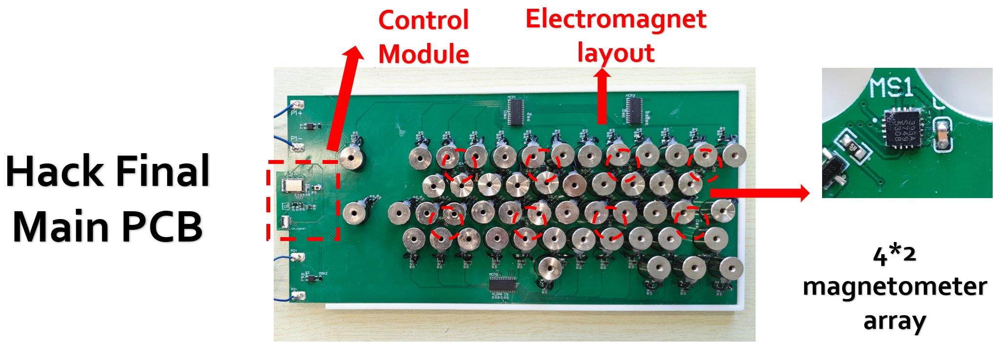
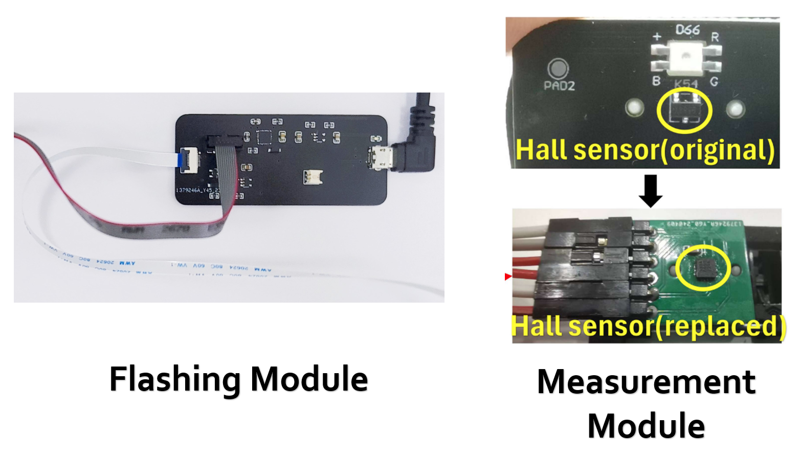

# Hardware Design of DualStrike

## Description

This directory contains the PCB design source files for DualStrike, including the main PCB, a flashing board for programming the MCU (MDBT42Q-512KV2), and a measurement board used for lightweight reverse engineering as described in Sec. IV.A (Fig. 5) of the paper.

## Directory Overview

- The `/Hack_Final` directory contains the main PCB used in the Attack device.
- The `/Flashing_Module` directory contains the flashing board used to program the MCU, enabling all possible functions of DualStrike.
- The `/Mesurement_Module` directory contains a PCB with the MLX90393 sensor, which can be used as a replacement for the original linear Hall effect sensor on Hall effect keyboards for measurement purposes.

## Hardware requirements
We utilize Altium to design PCB boards. After the PCB is manufactured, the hardware setup requires various components during the design and fabrication process. 
Below is a list of the components used in designing and manufacturing our prototype.
Note: In our implementation, the electromagnets used are the P16/25 model purchased from [electromagnet purchase site](https://detail.tmall.com/item.htm?_u=b203jth6ojcc40&id=19877659873&spm=a1z09.2.0.0.24482e8dYl79aS), with a total quantity of 51. We also provide a interactive HTML BOM file for each PCB to help facilitate the installation of electrical components. 

- Hack_Final Main PCB

The interactive HTML BOM file is provided in `Flashsing_Module/Flashing_Board_BOM.html`. 

Component | Description | Package | Quantity
--- | --- | --- | ---
Raytac MDBT42Q-512KV2 | Microcontroller Unit | 41-SMD | 1
Melexis MLX90393 | Magnetometer | 16-QFN | 1
HCI FC31M2-32.768-NTLNNDTL | 32.768kHz Surface Mount Crystal | SMD3215-2P | 1
Diodes Incorporated AP2112K-3.3TRG1 | Voltage Regulator | SOT-25-5 | 1
C&K KMR221GLFS | Tactile Switch | SMD | 1
DSK16 MDD| Diode | SOD-123FL | 53
AO3442 | N-channel Mosfet | SOT-23-3 | 51
Resistor | Chip Resistors | 0603 | 10kΩ(51)
Resistor | Chip Resistors | 0603 | 510Ω(51)
MLX90393SLW ABA 011 RE | Sensor | VQFN-16_EP_3.0x3.0xo.5P | 8
Vishay Intertech SI2301CDS-T1-GE3 | P-Channel MOSFET | SOT-23 | 1
Taiwan Semiconductor 1N4148WS RRG | Switching Diodes | SOD-323F | 1
LRC LMBR120FT1G | Schottky Diodes | SOD-123FL | 1
Resistor | Chip Resistors | 0402 | 1kΩ
Samsung CL05A105KA5NQNC | Capacitor | 0402 | 1µF
Yageo RC0402JR-070RL | Resistor | 0402 | 2
Samsung CL05A105KA5NQNC | Capacitor | 0402 | 2
Würth Elektronik 74404042022 | Inductor | 0402 | 1
Murata LQG15HS1N0S02D | Inductor | 0402 | 2
Murata LQG15HS2N2S02D | Inductor | 0402 | 1

- Flashing Board

The interactive HTML BOM file is provided in `\Hack_Final\Hack_Final.html`. 

Component | Description | Package | Quantity
--- | --- | --- | ---
Diodes Incorporated AP2112K-3.3TRG1 | Voltage Regulator | SOT-25-5 | 1
Vishay Intertech SI2301CDS-T1-GE3 | P-Channel MOSFET | SOT-23 | 1
LRC LMBR120FT1G | Schottky Diodes | SOD-123FL | 1
Microchip Tech MCP73831T-2ATI/OT | Battery Management | SOT-23-5 | 1
SKYWORKS/SILICON LABS CP2104-F03-GM | USB Converter | QFN-24-EP(4x4) | 1
TFM-105-12-S-D-A | Connector Header | SMD 10POS 1.27MM | 1
Resistor | Chip Resistors | 0603 | 1kΩ (3), 100kΩ (3)
Capacitor 0.1uF | Ceramic Capacitors | 0603 | 2
Capacitor 10uF | Ceramic Capacitors | 0805 | 5
PARALIGHT L-C191KRCT | LED Indication, Orange | 0603 | 1
SHOU HAN MicroXNJ | Micro-B USB Connectors | SMD | 1
JUSHUO AFC01-S08FCA-00 | FPC/FFC Connector | SMD, P=0.5mm | 1
HDGC HDGC1251WR-2P | Wire To Board Connector | Plugin, P=1.25mm | 1

- Measurement Board

The interactive HTML BOM file is provided in `Mesurement_Module\MeasureMent.html`. 

Component | Description | Package | Quantity
--- | --- | --- | ---
MLX90393SLW ABA 011 RE | Sensor | VQFN-16_EP_3.0x3.0xo.5P | 1
Capacitor 0.1uF | Ceramic Capacitors | 0603 | 1

