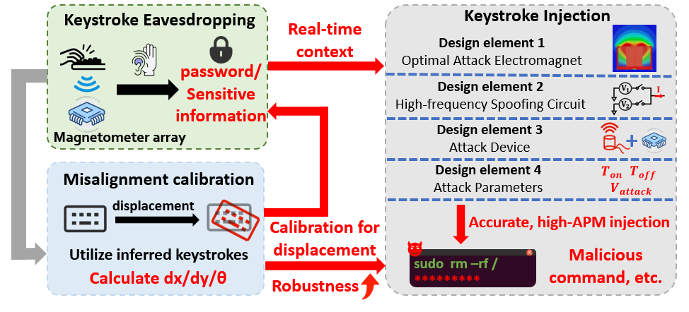
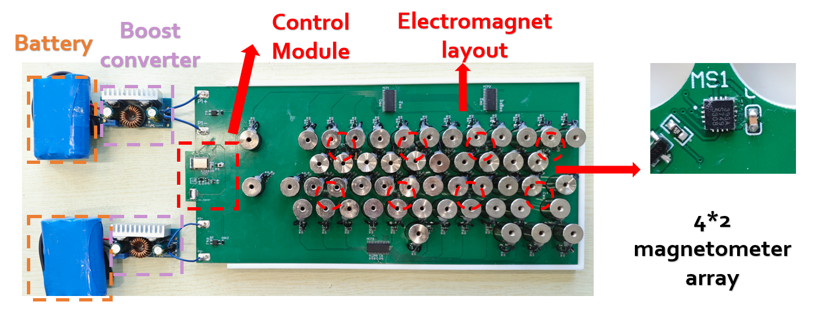
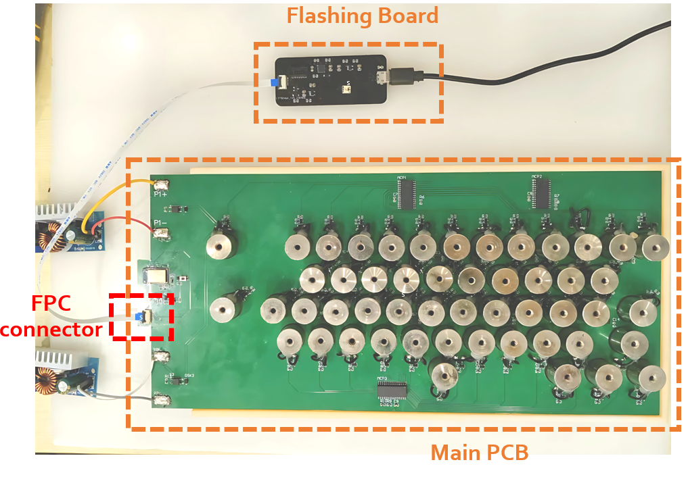
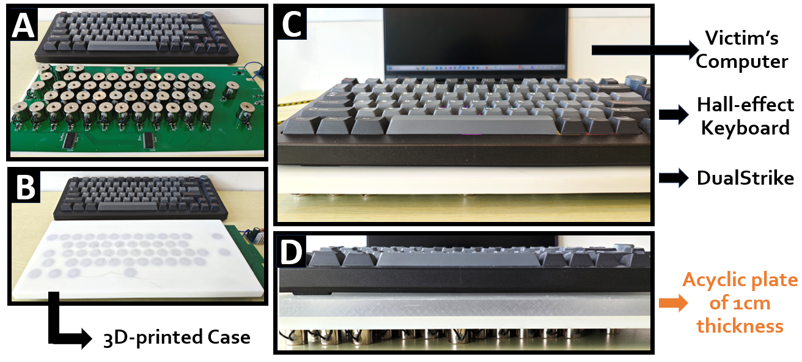

License
-------

[](LICENSE#code-license)

# The source code of the artifact submission for DualStrike in NDSS'26 Summer

This repository contains all software and hardware implementations of DualStrike.

## Overview

This artifact provides a complete framework for developing DualStrike, a new attack module that can perform both real-time keyboard listening and non-invasive, per-key
keystroke injection on Hall-effect keyboards, while also incorporating a calibration mechanism to mitigate real world disruptions such as keyboard displacements.

Its core design includes: 
1. We designed a universal attack device for Hall-effect keyboards, which can simultaneously leverage a magnetometer array for keystroke inference (eavesdropping) and an electromagnet array for per-key keystroke injection on Hall-effect keyboards.
2. We propose a novel, unified attack framework that combines both eavesdropping and keystroke injection in a single system. By incorporating a calibration mechanism, DualStrike significantly enhances robustness, enabling reliable attacks even under real-world disturbances such as keyboard displacement.
The demo video of DualStrike can be found in the link: https://sites.google.com/view/magkey-anonymous?usp=sharing



## Project Structure

- **[1.Hardware](1.Hardawre/README.md):** Source files for building the PCB of the DualStrike attack device.
- **[2.Firmware](2.Firmware/README.md):** Arduino code (PlatformIO framework) to run all DualStrike functions—keystroke injection, eavesdropping, and calibration—in real time and locally on the MCU control module.
- **[3.Software](3.Software/README.md):** Python code for collecting training data for the MLP model in the eavesdropping pipeline (Sec. V.A), and for offline data analysis supporting both eavesdropping and calibration.
- **[4.3D model](4.3D_model/README.md):** 3D design files for the DualStrike base.
- **[5.demo](5.demo/README.md):** Demo video of whole pipeline of DualStrike.


## Setup

To build and validate DualStrike, the following steps are required:

- [Fabricate the hardware](#fabricate-the-hardware)
- [Assemble the attack device](#assemble-the-attack-device)
- [Program the device](#program-the-device)
- [Set up the experiment environment](#set-up-the-experiment-environment)
- [Run the DualStrike pipeline](#run-the-dualstrike-pipeline)


### Fabricate the Hardware

We provide the hardware requirements and manufacturing details for the DualStrike PCB and 3D-printed model in [1.Hardware](1.Hardawre/README.md) and [4.3D model](4.3D_model/README.md). Users need to prepare and manufacture the main attack PCB and 3D-printed model in advance.


### Assemble the Attack Device

Solder the electromagnets onto the main PCB, assemble it with the 3D-printed case, and solder the battery and boost converter to complete the attack device.



### Program the Device

We use the PlatformIO framework to program the main PCB of the attack device according to the hardware specifications.

1. **PlatformIO Setup:**  
   PlatformIO can be installed as an extension in common IDEs such as Visual Studio Code. For our prototype, we use Version 3.3.4.

2. **Flashing:**  
   Connect the Main PCB and the flashing board as shown in the figure below. The flashing board is connected to the Main PCB via an FPC line and the FPC connector on the Main PCB. Then, connect the flashing board to your computer via USB first.



Once connected, click the `PlatformIO: Upload` button at the bottom of the IDE to flash the firmware.

You can choose to flash the `ReadSensor_Wired_Arduino` code to transmit raw magnetometer array data via serial port for offline processing and analysis with the Python implementation (`3.Software`).  
Alternatively, you can flash `2.Firmware/DualStrike_Arduino`, which can run independently on the MCU to enable all real-time functional features of DualStrike.

### Set Up the Experiment Environment

As shown in the figure below:

a. Prepare the attack device, the 3D-printed base, and the Hall-effect keyboard.
b. Invert the attack device so that the main PCB rests on the table with the 3D-printed base facing upward.
c. Place the Hall-effect keyboard on the base.



### Run the DualStrike Pipeline

After flashing, you can test DualStrike in two ways:

- **Python Implementation:**  
  Use Python scripts for offline processing and visualization of eavesdropping and calibration data.  
  For detailed workflow, see [3.Software/README.md](3.Software/README.md).

- **Arduino Implementation:**  
  Implements all functional features of DualStrike, running in real-time and locally on the MCU.  
  For details on operation modes and experiments, see [2.Firmware/DualStrike_Arduino/README.md](2.Firmware/DualStrike_Arduino/README.md).

## Getting Started with DualStrike

To help users quickly get started with our DualStrike system, we've provided an offline version of the sensing algorithm framework. The relevant data and source code include a dataset aligned with the experiments demonstrated in our demo. Users can utilize this data combined with the offline Python implementation to experience DualStrike functionality. However, since the keystroke injection function requires a Hall-effect keyboard as a carrier, we only record the injection results and timestamps for demonstration here, as the actual function requires a Hall-effect keyboard for implementation.

### 1. Keystroke Injection

Users can run `3.Software\compare.py` with the following settings:
- Set `MODE = "offline"`
- Set `OFFLINE_FILE_PATH = "3.Software/Data/keystroke_injection/injection1.txt"`

The txt file records the actual keystroke injection effects, representing the per-key injection results and injection timing. For example:
```
1, d, 13:41:05.052
2, u, 13:41:05.058
3, r, 13:41:05.065
4, i, 13:41:05.071
5, n, 13:41:05.077
......
590, b, 13:41:09.019
591, e, 13:41:09.025
592, r, 13:41:09.032
593, t, 13:41:09.039
594, i, 13:41:09.044
595, e, 13:41:09.051
596, s, 13:41:09.059
597, ., 13:41:09.065

```
After running `compare.py`, click the "play" button in the opened window to simulate the actual injection effects. You can observe that DualStrike can rapidly and accurately inject real-world sequence with 100% accuracy, which aligns with results in paper: Sec-VI.C(3) Real-world Sequence Injection. Readers can also refer to the demo video to show the real-time output of our injected sequence.

### 2. Keystroke Eavesdropping

Users first need to obtain 30 keystroke data samples for each key to train the eavesdropping model. Here we provide training data for the Wooting keyboard, located at `3.Software\Data\training_data`. We also provide the well-trained model at `3.Software\wooting_keypress_model2.pth` for verfication and further offline implementation.

To obtain the eavesdropping model, we follow the following steps:

1) Users need to first run `train_extract.py` to extract valid keystroke information from all data in `3.Software\Data\training_data`, generating `3.Software\wooting_peak_data2.csv`. The output will be similar to:
```
Key 'Shift': Sensor 5 has the maximum peaks (30)
Key 'Space': Sensor 7 has the maximum peaks (30)
Key 'T': Sensor 3 has the maximum peaks (31)
Key 'U': Sensor 3 has the maximum peaks (30)
Key 'V': Sensor 6 has the maximum peaks (30)
Key 'W': Sensor 5 has the maximum peaks (31)
Key '/': Sensor 8 has the maximum peaks (30)
Key 'X': Sensor 6 has the maximum peaks (30)
Key 'Y': Sensor 3 has the maximum peaks (30)
Key 'Z': Sensor 5 has the maximum peaks (31)
```
This code uses SecV-A’s eavesdropping implementation to extract keystroke-related peaks from the recorded 8-channel magnetometer data, and prepares them for subsequent model training.

Additionally, for each file in the training data, users can run `3.Software\segment_single_key.py` by specifying a `FILE_PATH = r'3.Software/Data/training_data/wooting_key_V.csv'`. This will generate peak detection visualizations similar to Fig.11 for each key, with output like:

```
Final detected peak count: 30 (from Sensor 6)
```

2) With the generated peak data csv `3.Software\wooting_peak_data2.csv`, users can then run `3.Software\classify.py` to train the model. The output file will be the trained model `3.Software\wooting_keypress_model2.pth`.

During training, you will see output similar to:
```
Epoch [1/80]:
  Average Loss: 5.7130
  Training Accuracy: 6.62%
  Validation Accuracy: 25.73%
Epoch [2/80]:
  Average Loss: 3.1449
  Training Accuracy: 23.90%
  Validation Accuracy: 62.19%
......
Epoch [79/80]:
  Average Loss: 0.0531
  Training Accuracy: 98.66%
  Validation Accuracy: 99.11%
Epoch [80/80]:
  Average Loss: 0.0472
  Training Accuracy: 99.04%
  Validation Accuracy: 99.11%
```
It also generates accuracy curves and a confusion matrix. The eavesdropping model achieves a test accuracy of 99.11%, which is consistent with the results reported in Section VI.B of the paper (‘Our model achieves an accuracy of 99.41% and 99.54% on keyboards #1 and #6’).

3) Users can then run `3.Software\offline_eavesdrop.py` to use the trained model for predictions on recorded keystroke data. For example, by setting `CSV_FILE_PATH = "3.Software/Data/keystroke_eavesdrop/eavesdrop1.csv"` and running the code, you will see output similar to:
```
Key 1: T (probability: 1.00) time: 1.66-1.84s triggered sensors: 3
Key 2: H (probability: 1.00) time: 2.70-2.92s triggered sensors: 2
Key 3: I (probability: 0.99) time: 3.86-4.04s triggered sensors: 4
Key 4: S (probability: 1.00) time: 4.64-4.84s triggered sensors: 3
Key 5: Space (probability: 0.99) time: 5.83-6.02s triggered sensors: 2
.....
Key 14: T (probability: 1.00) time: 13.74-13.92s triggered sensors: 4
Key 15: R (probability: 1.00) time: 14.32-14.52s triggered sensors: 2
Key 16: I (probability: 0.97) time: 15.16-15.36s triggered sensors: 4
Key 17: K (probability: 1.00) time: 15.98-16.16s triggered sensors: 3
Key 18: E (probability: 1.00) time: 16.73-16.94s triggered sensors: 3
Key 19: . (probability: 1.00) time: 18.38-18.61s triggered sensors: 2
```
This shows the prediction results for keystroke eavesdropping.

### 3. End-to-End Attack

Next, we simulate displacement by moving the keyboard from an aligned state by dx=3cm and dy=2cm. The whole process can be simulated with `3.Software\calibration_process.py` code. Specifically, as we declared in Section VI.E, we first introduce keyboard misalignment, then we perform calibration to estimate the displacement parameters. After this, We then emulated victim behavior by entering a 8-digit password on the displaced keyboard. DualStrike can record and perform calibration to obtain real input sequence. In the end, a sudo command attack will be achieved by combining a sudo command and listened password. DualStrike will also perform calibration to ensure the accuracy of injection.

Detailed steps can be found in the follwing part:

1) **Displacement Calibration**  
We use a recorded file `3.Software\Data\calibration\calibration1.csv`, which record the sensor reading during calibration. Then run `3.Software\calibration_process.py` to get output similar to:
```
Step 1: Running calibration to determine displacement parameters...
.....
Predicting using 8 sensors
Peak 4.85s-5.14s: True=Q, Predicted=3, Probability=1.000
Peak 6.38s-6.70s: True=R, Predicted=6, Probability=1.000
Peak 8.48s-8.81s: True=U, Predicted=9, Probability=1.000
Peak 10.18s-10.46s: True=Z, Predicted=D, Probability=1.000
Peak 11.80s-12.16s: True=V, Predicted=H, Probability=1.000
Peak 13.37s-13.65s: True=M, Predicted=L, Probability=1.000
......
==================================================
CALCULATING DISPLACEMENT USING WLS METHOD
==================================================

WLS Analysis using 6 key pairs:
True: Q, Predicted: 3, Probability: 1.0000
True: R, Predicted: 6, Probability: 1.0000
True: U, Predicted: 9, Probability: 0.9999
True: Z, Predicted: D, Probability: 0.9999
True: V, Predicted: H, Probability: 1.0000
True: M, Predicted: L, Probability: 1.0000

WLS Transformation Results:
Displacement dx: 28.57 mm
Displacement dy: 19.30 mm
Rotation theta: 0.0000 radians (0.00 degrees)
Number of key pairs used: 6
......
==================================================
FINAL DISPLACEMENT RESULTS
==================================================
Keyboard displacement:
  X-axis: 28.57 mm
  Y-axis: 19.30 mm
Analysis based on 6 key pairs
==================================================
```
This shows successful calculation of the current displacement.

2) **Calibration of Eavesdropping Data**  
We simulate user input on the displaced keyboard. DualStrike can calibrate the eavesdropped data to obtain the user's actual input keys. For example, we use `3.Software\generate_secrets.py` to generate a random 8-digit sequence "qrqebrhw" as a password, input it on the keyboard, and record the data as `3.Software\Data\calibration\eavesdrop1.csv`. We can see the code output of 2nd phase:
```
Step 2: Processing eavesdrop data with calibration correction...

==================================================
PROCESSING EAVESDROP DATA WITH CALIBRATION
==================================================
Raw predictions: 8 keys detected
  predicted_key  probability
0             3     0.999986
1             6     0.999990
2             3     0.999975
3             5     0.851736
4             J     0.999573
5             6     1.000000
6             I     0.982050
7             4     0.999806

Applying calibration correction...
Using calibration parameters: dx=28.57mm, dy=19.30mm, θ=0.00°
✓ 3.66s: 3 → Q (dist: 0.3mm)
✓ 6.71s: 6 → R (dist: 0.3mm)
✓ 8.68s: 3 → Q (dist: 0.3mm)
✓ 10.54s: 5 → E (dist: 0.3mm)
✓ 12.00s: J → B (dist: 0.3mm)
✓ 12.82s: 6 → R (dist: 0.3mm)
✓ 13.68s: I → H (dist: 4.8mm)
✓ 14.43s: 4 → W (dist: 0.3mm)

==================================================
FINAL EAVESDROP RESULTS
==================================================
Detected keystrokes:
qrqebrhw
```
This demonstrates that DualStrike can obtain the real input sequence through calibration even on a displaced keyboard.

3) **Calibration of Attack Data**  
We then simulate inputting an attack sequence on the displaced keyboard. The input sequence is a sudo command + the 8-digit password. After composing this sequence, we also need calibration to determine the actual keys to attack for injecting this sequence. We can obtain the 1:1 mapping with output similar to:
```
============================================================
STEP 3: ATTACK MODE
============================================================
Original attack sequence: 'sudo mkfs.ext /dev/sda qrqebrhw'
Using calibration parameters: dx=28.57mm, dy=19.30mm, θ=0.00°

Calibrated attack analysis:
Calibrated attack: s -> R (distance: 4.8mm)
Calibrated attack: u -> 9 (distance: 0.3mm)
Calibrated attack: d -> T (distance: 4.8mm)
Calibrated attack: o -> - (distance: 0.3mm)
Calibrated attack:   -> M (distance: 7.1mm)
Calibrated attack: m -> L (distance: 0.3mm)
Calibrated attack: k -> P (distance: 4.8mm)
Calibrated attack: f -> Y (distance: 4.8mm)
Calibrated attack: s -> R (distance: 4.8mm)
......
```
This ensures the actual attack implementation is correctly targeted.

4) **Display end-to-end result**  
Similar to the keystroke injection, we record the actual injection sequence in a txt file. Readers can refer to the demo for the visualization of injection results. The code compares the expected input sequence and real input sequence:
```
Character-by-character breakdown:
   1. ✓ Actual: s        | Expected: s
   2. ✓ Actual: u        | Expected: u
   3. ✓ Actual: d        | Expected: d
   4. ✓ Actual: o        | Expected: o
   5. ✓ Actual: [SPACE]  | Expected: [SPACE]
.....
  28. ✓ Actual: b        | Expected: b
  29. ✓ Actual: r        | Expected: r
  30. ✓ Actual: h        | Expected: h
  31. ✓ Actual: w        | Expected: w
```
The end-to-end attack offline implementation is done.